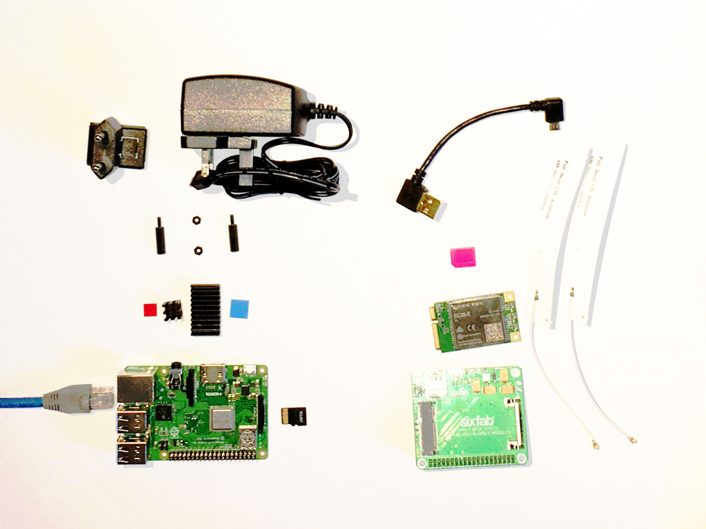
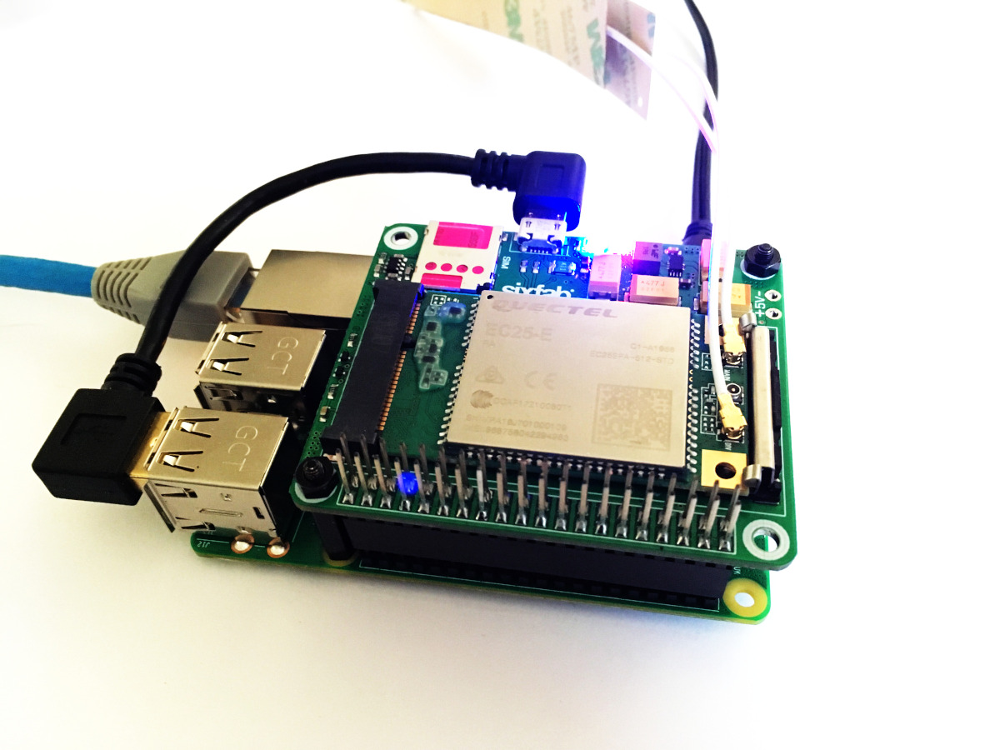

# 4Gbot

The aim of the project was to create and to easily reproduce a 4G/LTE enabled raspberry pi with kali linux for security testing with Red Team approach.


## TL;DR

### On your workstation

```
git clone https://github.com/whiteshield/4Gbot.git 4Gbot
cd 4Gbot
./4Gbot-pre bot01key 192.168.1.2 1.2.3.4 root 22
```

Parameters:

- `bot01key`: ssh keyfile name
- `192.168.1.2`: your kali bot ip address
- `1.2.3.4`: your master server's ip address
- `root`: user name for connecting to master
- `22`: master server's ssh port number

### On your kali bot

```
passwd
git clone https://github.com/whiteshield/4Gbot.git 4Gbot
cd 4Gbot
./4Gbot-init bot01 "Telekom HU" internet ttyUSB3 bot01key 1.2.3.4 root 22 22001 59001
reboot
```

Parameters:

- `bot01`: your kai bot's name
- `"Telekom HU"`: internet provider
- `internet`: APN
- `ttyUSB3`: sixfab device
- `bot01key`: ssh keyfile name
- `1.2.3.4`: your master server's ip address
- `root`: user name for connecting to master
- `22`: master server's ssh port number
- `22001`: tunneled ssh port on master
- `59001`: tunneled vnc port on master

## Before we start

### Hardware requirements for bot



- raspberry pi model 3 B+
- power adapter (official 5.1V, 2.5A)
- at least 16 GB sdcard (32 GB sdcard with extreme heat resistance recommended)
- 2 pc M2.5 standoffs 16mm tall
- [raspberry pi 4G/LTE shield kit from sixfab](https://sixfab.com/product/raspberry-pi-4g-lte-shield-kit/)
- SIM card with mobile data option (APN necessary)
- ethernet cable (and local network connection with DHCP)

Why sixfab? The shields work properly, and they do world wide shipping.



### Software requirements for your workstation

- ssh-copy-id in your terminal
- kali linux raspberrypi 3 64 bit [2019.2 at the present time](https://www.offensive-security.com/kali-linux-arm-images/#1493408272250-e17e9049-9ce8)
- [balena etcher](https://www.balena.io/etcher/) (or other image writer)

### Master server requirement

- directly accessible from the internet
- passwordless login enabled
- kali linux recommended 

## Steps

### Kali basic setup

Stick the coolers to the rpi, add standoffs, assemble sixfab shield, put the shield in place, connect with usb to the rpi, insert a SIM card. That's all, takes a few minutes only.

Write the kali image with balena etcher to an sdcard.

Insert sdcard to rpi. Connect both ethernet cable and power adapter. You need a DHCP server on the local network for flawless setup.

Wait a few seconds, and find your kali with nmap (your kali will have an open ssh port).

Log in with ssh, username `root`, password `toor`.

**Change your password with `passwd`!**

At this stage, you will have a working kali on rpi.

### Setup passwordless login

I used my macbook to generate a passwordless ssh key, and added a public key to `authorized_keys` file on the kali bot and master server. I also copied the private keys to the bot and master too, this is required for later use. And of course, I loaded the key.

If you have OSX (or linux) on your workstation, I encourage you to clone the repo to your machine and use `4Gbot-pre` to do the work.

For windows users, generate an ssh key with puttygen, copy it to your fresh kali bot and to your master server `~/.ssh/` folder. If the folder does not exist, create it, but do not forget to configure the access rights with chmod to 0700. And create an `authorized_keys` file as well with 0600 rights within `/root/.ssh/`, and copy your public key into that file too. You can use that key to log on to your kali bot too. Set it in your putty session or in pageant (putty ssh authentication agent).

Do not forget to check the passwordless login with simple ssh commands, such as `ssh root@kalibotip` and `ssh masteruser@masterip` on your workstation, and `ssh masteruser@masterip -i /root/.ssh/keyfilename -p mastersshport` on your kali bot. If you would like to use agent forwarding, use `ssh -A` when you connect to your kali bot.

### Setup your rpi

Clone the repo to your home directory:

`git clone https://github.com/whiteshield/4Gbot /root/4Gbot`

Start the init script (finally!):

```
cd /root/4Gbot
./4Gbot-init
```

Answer the questions, and voila, the script does the donkey work. It sets up the followings:

- creates a swap (I know, there is a lot of debate, but I prefer a slower rpi to a halted rpi with 'not enough memory' error)
- changes kali ssh host keys
- sets the timezone to Etc/UTC and update it
- installs plenty of packages (not the kali full metapackage), just those that we usually use in red team assessments
- enables and starts apache, postgre sql
- enables permanent ipv4 forwarding
- disables ModemManager and lightdm
- runs  `msfdb init`
- enables and starts pureftpd and creates a user named `ftp` with password `ftppass` in folder `/ftphome`
- deletes `ntp-servers` from dhclient configuration
- sets a new hostname
- creates `/root/bin/` folder and adds to `$PATH` in `.bashrc`
- sets a prompt with time
- creates a `.screenrc` file with logging
- configures a localonly vnc server on :1 with password `vncpass`
- setups ppp with your operator and apn. In case the device is not found or the 4G connection is not working, restart the rpi in a few minutes (!!!)
- creates an autossh service to forward your kalibot's ssh port to your master server
- creates an autossh service to forward your kalibot's vnc port to your master server
- writes a statuslog to /var/log/4Gbot

For these operations, the script uses the files in `4Gbot/new/` directory and does a backup for everything with timestamp to `4Gbot/backup/` folder.

Reboot your kali, and cross your fingers.

After the restart you can see a connected `ppp0` device in `ifconfig`.

You can log in on your master to the bot:

`ssh root@localhost -p mastersshtunnelport -i /root/.ssh/keyfilename`

You can tunnel the vnc on your workstation:

`ssh -L 5901:localhost:mastervnctunnelport -N -f masteruser@masterip -p mastersshport`

You can access your rpi's vnc on `localhost:1`.

#### Troubleshooting

If the connection is not working, simply run `netstat -utapen` on your master, find and kill the process which connects to your mastersshtunnelport or mastervnctunnelport. Autossh will reconnect within a minute.

When you are connected through 4G network, sometimes somehow `/etc/resolv.conf` is not updated with the network provider data. You need to update it manually or with the `overwriteResolv` command.

Wait half a minute. Autossh has 30 seconds timeout when something wrong happened.

### For the experts

This project aims to automate the whole process, for regular use as you clean the kali between the assessments. You have multiple options!

#### Command line parameters

You can start the init scripts with parameters:

```
./4Gbot-init botname operator apn usbdevice keyfile masterip masteruser mastersshport mastersshtunnelport mastervnctunnelport
```

#### Parameters in file

You can use `4Gbot-variables-override` file to override the default settings:

```
cp 4Gbot-variables-override.sample 4Gbot-variables-override
```

Edit this file and use noninteractive mode.

```
FOURGBOTINTERACTIVE="NONINTERACTIVE" ./4Gbot-init
```

Moreover, if you would like to change the files in `4Gbot/new/` directory, you can add your own version to `4Gbot/override/` folder. In this way, your repo can be updated, and your changes will not be overwritten with `git pull`. And you can copy your files between the projects – if you make a copy from them.

### Useful commands

**On your workstation:**

- `ssh-keygen -R kalibotip`
- `ssh -L 5901:localhost:mastervnctunnelport -N -f masterusert@masterip -p mastersshport`

**On your kali bot:**

Use screen, to enhance stability of your tunneled work:

- `screen`
- `screen -r`

Get service statuses:

- `systemctl status 4Gbot-autorestart.service`
- `systemctl status 4Gbot-autossh-ssh.service`
- `systemctl status 4Gbot-autossh-vnc.service`
- `systemctl status 4Gbot-ppp-reconnect.service`
- `systemctl status 4Gbot-status-logger.service`
- `systemctl status 4Gbot-vnc-server@1.service`
- `systemctl status 4Gbot-*`
- `cat /var/log/syslog | egrep "(COPS:|CSQ:)" | tail -n 2` [COPS](https://m2msupport.net/m2msupport/atcops-plmn-selection/) [CSQ](https://m2msupport.net/m2msupport/atcsq-signal-quality/)

Network management:

- `systemctl enable NetworkManager`
- `netstat -utapen`
- `overwriteResolv`
- `enablePpp`
- `disablePpp`
- `disableEth0Dhcp`
- `enableEth0Dhcp`
- `tcpdump -i eth0 -vv`
- `dhclient eth0 -v`
- `route add serverip gw gatewayip eth0`


### Caution

During the assessment you will leave your rpi in a „hostile” environment, even in open places. There is a possibility that it will be stolen or even used.

#### Keep your master server safe

When you are not using your kali bot, comment the public key in your master `/root/.ssh/authorized_key`s file, and kill the open ssh tunnel.

#### Encrypted containers

We recommend using encrypted file containers, read below.

### Extras

#### Encrypted file containers

The `4Gbot-container` script gives an easy to use interface to manage encrypted file containers.

You can **c**reate, **m**ount, **u**nmount and **l**ist file containers.

`./4Gbot-container c|m|u|l [volumename [volumesize]]`

#### You can be a sourcerer

The `4Gbot-source` scripts use bash functions, which will be available in your command prompt, and your modified `.bashrc` load them (`source 4Gbot-source`).

Available commands:

- addBin
- addScreenrc
- disableAutossh
- disableEth0Dhcp
- disableLightdm
- disablePpp
- enableAutossh
- enableEth0Dhcp
- enableLightdm
- enablePpp
- initAutossh
- initDhclient
- initFtp
- initHost
- initInstall
- initPpp
- initServices
- initSsh
- initSwap
- initTimezone
- initVnc
- overwriteResolv

## Warnings

Clone it, use it, fork it only on your own risk!

## Acknowledgements

Thank you for [null byte on wonderhowto](https://null-byte.wonderhowto.com/) and [sixfab](https://sixfab.com/), we wrote these scripts based on their shared contents.

